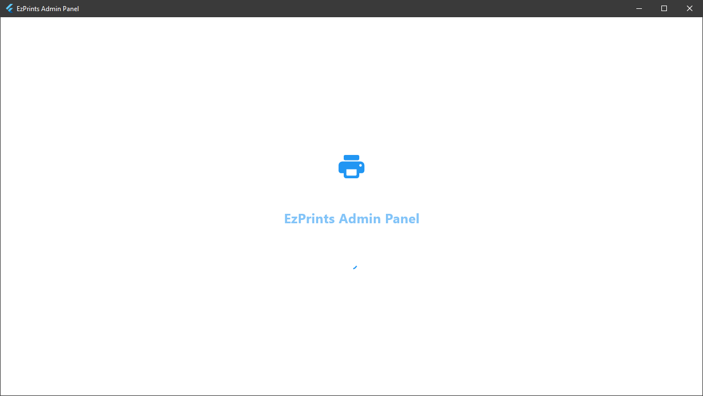
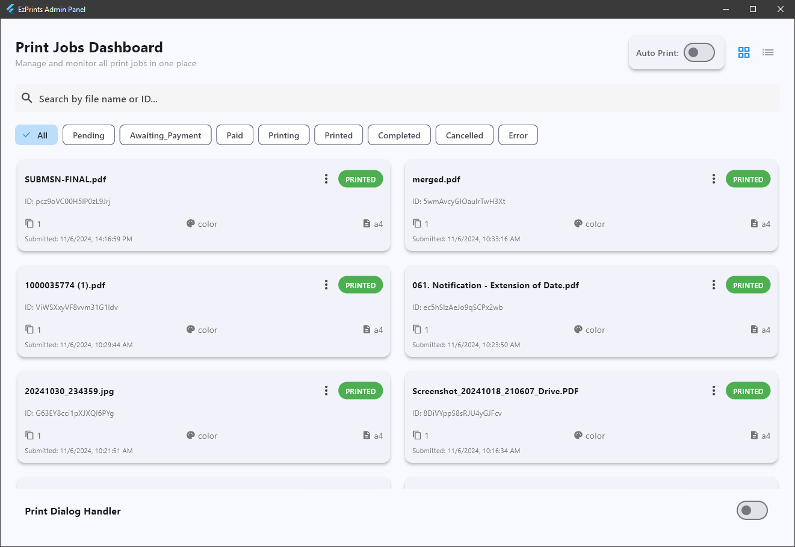
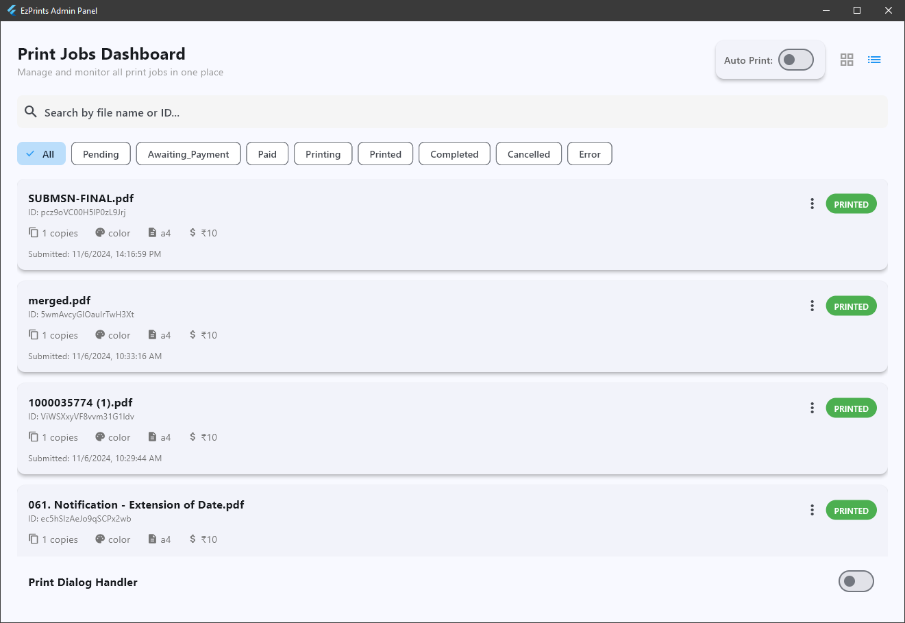
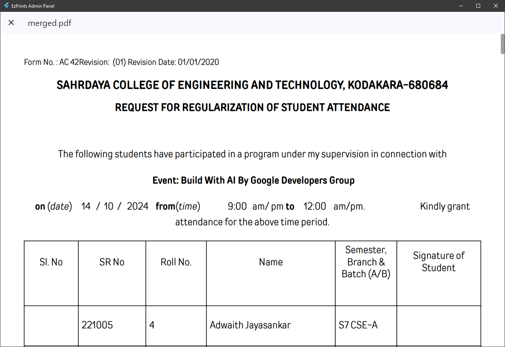
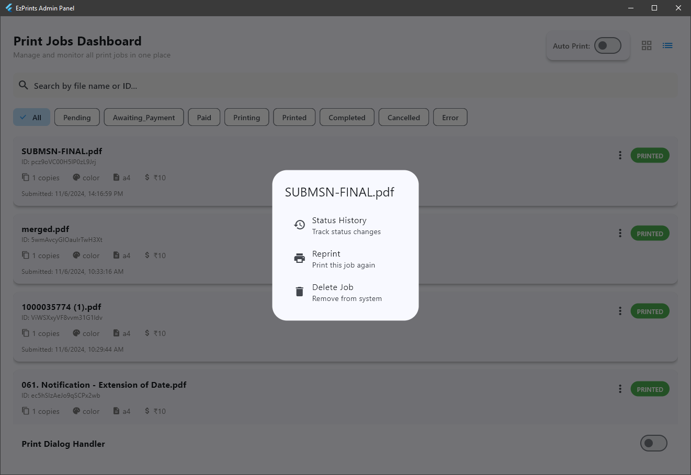
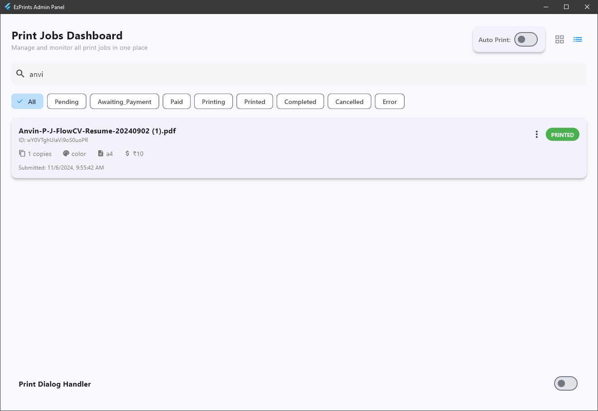

# EzPrints 2.0 Admin Panel

A Flutter-based admin panel for managing print jobs with Firebase integration. Features include real-time job tracking, automated printing, PDF preview, and a print dialog handler. Perfect for print shops or document management systems.

## Screenshots
### 1. Loading  Screen

### 2. Dashboard Grid View  

### 3. Dashboard List View

### 4. PDF Preview

### 5. More Details

### 6. Search and Filter


## Demo Video


## ✨ Key Features

- 🔄 Real-time print job tracking and management
- 🖨️ Automated printing system with status updates
- 📱 Responsive grid/list view layouts
- 🔍 Advanced search and filtering capabilities
- 📄 Built-in PDF preview functionality
- 🤖 Automated print dialog handling (Python integration)
- 🎨 Modern Material Design 3 UI
- 🔐 Admin authentication system
- 📊 Job status tracking and history

## 🚀 Getting Started

### Prerequisites
- Flutter 3.0 or higher
- Firebase account
- Python 3.x (for print dialog handler)

### Installation

1. Clone the repository
```bash
git clone https://github.com/Abelboby/EzPrints2.0-Admin
cd EzPrints2.0-Admin
```

2. Install Flutter dependencies
```bash
flutter pub get
```

3. Configure Firebase:
   - Create a new Firebase project
   - Download `google-services.json` for Android
   - Download `GoogleService-Info.plist` for iOS
   - Add files to respective platform folders
   - Update `lib/firebase_options.dart`

4. Set up Python print handler:
   - Install Python requirements
```bash
pip install pywin32 keyboard
```

5. Run the application
```bash
flutter run
```

## 📦 Dependencies

```yaml
dependencies:
  flutter:
    sdk: flutter
  firebase_core: ^latest
  cloud_firestore: ^latest
  syncfusion_flutter_pdfviewer: ^latest
  printing: ^latest
  path_provider: ^latest
  http: ^latest
```
## 🔥 Firebase Setup & Configuration

### 1. Project Setup
1. Create a new Firebase project at [Firebase Console](https://console.firebase.google.com/)
2. Enable Firestore Database
3. Set up Authentication methods as needed

### 2. Environment Configuration
1. Create environment files in your project root:

```plaintext
# .env.example (template file - safe to commit)
FIREBASE_API_KEY=your_api_key_here
FIREBASE_APP_ID=your_app_id_here
FIREBASE_MESSAGING_SENDER_ID=your_sender_id_here
FIREBASE_PROJECT_ID=your_project_id_here
FIREBASE_AUTH_DOMAIN=your_auth_domain_here
FIREBASE_STORAGE_BUCKET=your_storage_bucket_here
FIREBASE_MEASUREMENT_ID=your_measurement_id_here
```

2. Copy `.env.example` to `.env` and fill in your actual Firebase values
3. Add to your `.gitignore`:
```plaintext
# Environment files
.env
.env.local
*.env
!.env.example
```

### 3. Firestore Setup
1. Create the following collections structure:
```
ezprints-2/
├── orders/
│   ├── document_id/
│   │   ├── customerName: string
│   │   ├── orderStatus: string
│   │   ├── pdfUrl: string
│   │   ├── timestamp: timestamp
│   │   └── copies: number
└── settings/
    └── printer_config/
        ├── defaultPrinter: string
        └── isAutomatic: boolean
```

2. Set Firestore security rules:
```javascript
rules_version = '2';
service cloud.firestore {
  match /databases/{database}/documents {
    match /{document=**} {
      allow read, write: if request.auth != null;
    }
  }
}
```

[Update the Building the Application section to:]

## 📦 Building the Application

### Development Build
1. Ensure your `.env` file is properly configured
2. Run the development build:
```bash
flutter run
```

### Production Build
Option 1: Using command line:
```bash
flutter build windows \
  --dart-define=FIREBASE_API_KEY=your_api_key \
  --dart-define=FIREBASE_APP_ID=your_app_id \
  --dart-define=FIREBASE_MESSAGING_SENDER_ID=your_sender_id \
  --dart-define=FIREBASE_PROJECT_ID=your_project_id \
  --dart-define=FIREBASE_AUTH_DOMAIN=your_auth_domain \
  --dart-define=FIREBASE_STORAGE_BUCKET=your_storage_bucket \
  --dart-define=FIREBASE_MEASUREMENT_ID=your_measurement_id
```

Option 2: Using build script (Windows):
1. Create `build.bat`:
```batch
@echo off
flutter build windows ^
  --dart-define=FIREBASE_API_KEY=%FIREBASE_API_KEY% ^
  --dart-define=FIREBASE_APP_ID=%FIREBASE_APP_ID% ^
  --dart-define=FIREBASE_MESSAGING_SENDER_ID=%FIREBASE_MESSAGING_SENDER_ID% ^
  --dart-define=FIREBASE_PROJECT_ID=%FIREBASE_PROJECT_ID% ^
  --dart-define=FIREBASE_AUTH_DOMAIN=%FIREBASE_AUTH_DOMAIN% ^
  --dart-define=FIREBASE_STORAGE_BUCKET=%FIREBASE_STORAGE_BUCKET% ^
  --dart-define=FIREBASE_MEASUREMENT_ID=%FIREBASE_MEASUREMENT_ID%
```

2. Run the build script:
```bash
.\build.bat
```

## 🛠️ Configuration

### Firebase Setup
1. Enable Firestore in your Firebase console
2. Set up authentication methods
3. Configure Firestore rules:

```javascript
rules_version = '2';
service cloud.firestore {
  match /databases/{database}/documents {
    match /{document=**} {
      allow read, write: if request.auth != null;
    }
  }
}
```

### Print Dialog Handler
The Python script (`print_dialog_handler.py`) automatically handles system print dialogs. Ensure it has necessary permissions to:
- Monitor keyboard events
- Control system dialogs
- Access printer services

## 🤝 Contributing

1. Fork the repository
2. Create your feature branch (`git checkout -b feature/AmazingFeature`)
3. Commit changes (`git commit -m 'Add AmazingFeature'`)
4. Push to branch (`git push origin feature/AmazingFeature`)
5. Open a Pull Request


## 👥 Contact


Project Link: [https://github.com/Abelboby/EzPrints2.0-Admin](https://github.com/Abelboby/EzPrints2.0-Admin)

## 🙏 Acknowledgments

* [Flutter](https://flutter.dev)
* [Firebase](https://firebase.google.com)
* [SyncFusion Flutter PDF Viewer](https://www.syncfusion.com/flutter-widgets/flutter-pdf-viewer)